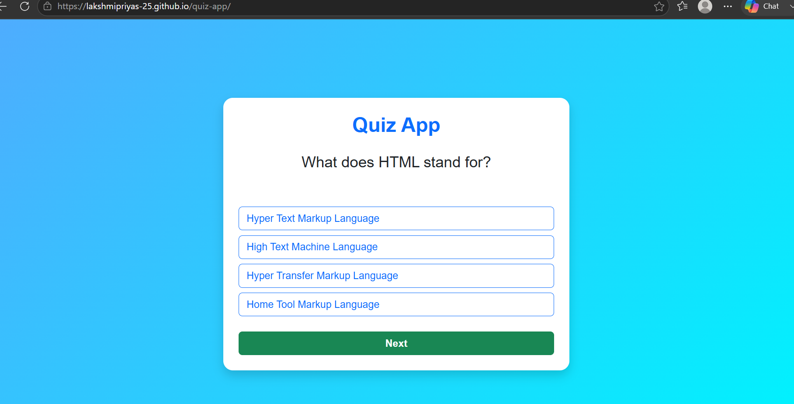

# 🧠 Quiz App

A simple and responsive Quiz App built using HTML, CSS, Bootstrap, and JavaScript. This application allows users to answer multiple-choice questions, displays the final score, and lets users restart the quiz.

---

## 🚀 Live Demo

🔗 **Live Demo:** https://your-live-demo-link.com

---

## 💻 Source Code

```bash
git clone https://github.com/your-username/quiz-app.git
```

Or visit the repository:

https://github.com/your-username/quiz-app

---

## 📸 Screenshot



---

## ✨ Features

- 📝 Multiple-choice quiz questions
- ✅ One answer selection per question
- 📊 Score calculation
- ➡️ Next question navigation
- 🎉 Final score display
- 🔄 Restart quiz functionality
- 📱 Responsive design using Bootstrap

---

## 🛠️ Built With

- HTML5
- CSS3
- Bootstrap 5
- JavaScript (ES6)

---

## 📚 Concepts Learned

- DOM Manipulation
- Arrays & Objects
- Array of Objects
- Event Listeners
- forEach()
- Functions
- Conditional Statements (if...else)
- Template Literals
- classList.add() & classList.remove()
- innerHTML
- location.reload()

---

## 📂 Project Structure

```text
Quiz-App/
│── index.html
│── style.css
│── script.js
│── README.md
└── images/
    └── quiz-app.png
```

---

## ⚙️ Getting Started

1. Clone this repository.
2. Open the project in Visual Studio Code.
3. Open `index.html` in your browser or run it using Live Server.

---

## 📸 Application Preview

The application includes:

- ❓ Quiz Questions
- 🔘 Multiple Choice Options
- ➡️ Next Button
- 📈 Score Display
- 🔄 Restart Quiz Button

---

## 🚀 Future Enhancements

- ⏳ Quiz Timer
- 📊 Progress Bar
- 🎯 Difficulty Levels
- 🌙 Dark Mode
- 🏆 High Score Storage using Local Storage

---

## 👩‍💻 Author

Lakshmi Priya S

Aspiring Python Full Stack Developer passionate about building responsive and user-friendly web applications using HTML, CSS, Bootstrap, JavaScript, and Python.